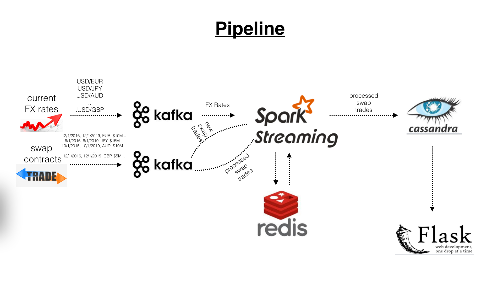

# "Game Of Derivatives" - Market is dark and full of thieves.
insight data engineering - fall 2017

# Business case
Companies with large asset base trade in the derivatives market to hedge their assets but not every company is successful in doing so. The objective of the project is to find 
  - how much money they owe in the market?
  - what is company X’s investment risk if it trades with company Y?
  - what is company X's exposure to changing exchange rates?

# Industry
This problem focuses on the financial industry but the technical implementation can be used in any industry which require fast computation with realtime analytics

# Stream Processing
Ingested historical and projected interest rates, streamed current FX rates, streamed historically traded contracts between 750 companies, calculated the price of each trade (100K contracts), re-calculated the value of 100k contracts every time there is a change in exhange rates under 10 seconds

# Source of Data
Generated (and ingested) Swap contract data (ex: start date, end date, frequency of payments etc.), streamed random FX and ingested projected interest rate data

# Pipeline

# Project highlights
- Continuous streaming of data and writing to Cassandra, 
- Usage of Redis database to store 4GB of trade contracts
- 3 sets of Kafka producers, spark streaming consumers
- Kafka streaming topics by currency
- Pricing algorithm

# Technical challenges:
- Fetching trades from Cassandra database every time FX rates change - Solution: Redis
- Recalculate the value of trades as exchange rates change frequently and write to Cassandra - Solution: continuously read the trades from Redis as the exchange rates change, price, stream and write to Cassandra

# Project front-end

